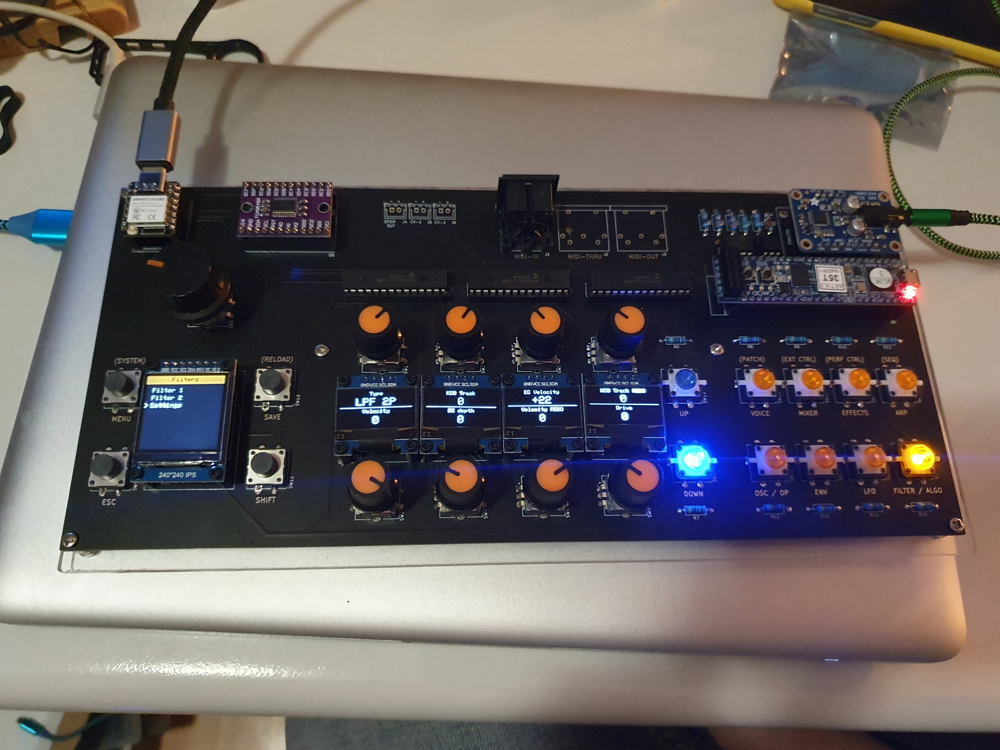
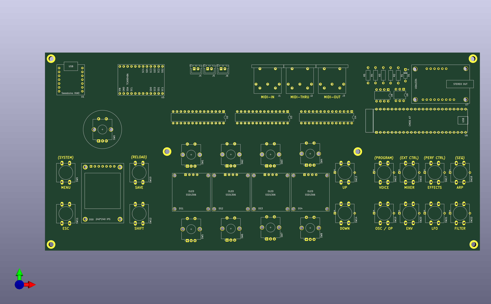

# XVA1 User Interface

A hardware user interface for the [XVA1 virtual analog synthesizer](https://www.futur3soundz.com/), inspired by the Hydrasynth's layout. The XVA1 (and its FM sibling the XFM2) is built on an Artix-7 FPGA but has no built-in UI — this project adds one.



## Overview

The UI board provides:

- **1 main rotary encoder** — patch selection and menu navigation
- **8 parameter rotary encoders** — control up to 8 synth parameters at once
- **4 OLED displays (128×64)** — show parameter names and values for each encoder pair
- **1 TFT display (240×240)** — main display showing patch name, section, and subsection
- **8 shortcut buttons with LEDs** — jump directly to parameter sections (Oscillators, Filters, Envelopes, LFOs, etc.). Hold SHIFT + buttons 1–4 to access sections 9–12
- **Up/Down buttons with LEDs** — scroll through parameter pages within a section

The design goal was minimal menu-diving: select a section with one button press, then tweak up to eight parameters directly with the encoders.

## Hardware

- **MCU:** Seeed XIAO ESP32-S3 (240 MHz, dual-core)
- **IO expansion:** 2× MCP23017 (the 8 parameter encoders connect via I2C)
- **Display mux:** TCA9548A I2C multiplexer for the 4 OLED displays
- **Synth connection:** UART at 500,000 baud (D6 TX, D7 RX)
- **PCB size:** 285 mm × 130 mm
- **Buttons:** PB86-B1 (with LED) / PB86-B0 (without LED), available from AliExpress

KiCad schematics are in the `Hardware/` directory.



## Build History

The project started in early 2021 on a breadboard with a Seeeduino XIAO (SAMD21), then moved to an ESP32 devboard when memory became a bottleneck, and eventually settled on the **Seeed XIAO ESP32-S3** as a drop-in replacement with the same footprint. The first PCB prototype was ordered from JLCPCB and had a few minor errors (MIDI DIN pin swap, resistor silkscreen mix-up) that were corrected in subsequent revisions.

## Software

Firmware source is in `Software/XVA1UserInterface/` and built with [PlatformIO](https://platformio.org/).

```bash
# Run from Software/XVA1UserInterface/
platformio run                  # compile
platformio run -t upload        # compile and flash
platformio run -t monitor       # open serial monitor (115200 baud)
./upload_and_monitor.sh         # flash then monitor
```

See `AGENTS.md` for a full architecture breakdown and development notes.

## Project Structure

```
Hardware/       KiCad schematics and datasheets
Docs/           Photos of front and back of the board
Software/
  XVA1UserInterface/   PlatformIO project (all firmware lives here)
```

## Status

Working prototype. Most parameters are implemented and editable. Patch saving is not yet implemented. The PCB design has gone through two revisions; the current version uses the XIAO ESP32-S3.

## License

See `LICENSE.md`.
